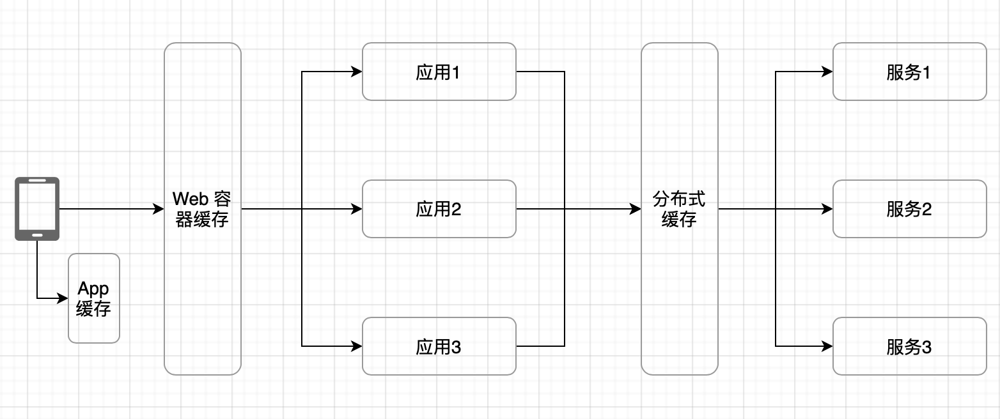

# 1. 确定功能需求

实际电商场景中，秒杀系统涉及到的业务可能比较复杂，由于我不从事电商行业，按自己的理解脑补如下：

1. 开始，平台、商家、库存、物流等相关方共同谋划，确认业务上的可行性和技术上的基本可用性
2. 发展，运营团队宣传秒杀活动，制定秒杀规则
3. 高潮，秒杀现场，核心业务是商品浏览、购物车和支付
4. 结局，系统自动或人工的销核工作，问题补偿措施等

第1步技术参与度不高，但会为业务奠定基调，影响技术选型和业务、技术上的决策，架构师务必参加；
第2步可以基于规则引擎等形成独立的系统，若有现成的规则系统，则评审是否满足此次秒杀需求，若无，可以考虑是否定制实现，做一定的抽象设计，为规则系统独立积累经验；
第3步是核心，也是最能考虑技术能力的环节，在满足业务需求的前提下，相关非功能需求的设计实现也要深思熟虑；
第4步主要基于现有规则和系统，从单次秒杀活动的业务需求出发，可能不会涉及到太多架构设计和开发工作，但可能通过秒杀活动的整个生命周期，暴露现有系统、规则的漏洞，因此也要关注，并把相关问题纳入中长期研发规划中去。

本文接下来的内容，基于业务场景最容易脑补场景的“高潮”部分开展，业务主要是浏览商品，购物车和订单

1. 浏览商品，要保证秒杀前后，商品能正常浏览查看
2. 购物车，主要功能是，当商品有库存时，允许把商品加入购物车
3. 订单，主要功能是，订单创建、支付和查看，订单相关操作要保证商品记录和库存记录的吻合、一致性

# 2. 确定性能指标（非功能需求）

本文基于以下假设做性能指标分析:

1. 正常的日活大约 100 万用户;
2. 秒杀当天，有 40%的用户参与秒杀;
3. 每个时刻，只有 1 个商品进行秒杀(若多个商品同时秒杀，TPS和QPS均摊到多个商品上，性能要求比单个商品只低不高)
4. 假设此次秒杀商品为10台iPhone
5. 确保秒杀活动万无一失（高可用设计）

## 2.1 浏览商品

参与秒杀用户中，假设最后 10 秒刷新页面浏览商品的占 60%，则浏览商品的 QPS 为：100 万 * 0.4 * 0.6 / 10 = 2.4 万/s
商品库存可以与购物车业务共享一套，用户的浏览历史，可以不考虑或做降级处理，本业务的存储可以忽略不计

## 2.2 购物车

假设 40 万秒杀用户中，80%用户在 5 秒内点击了加入购物车操作，其中 5%加入购物车成功，则，

加入购物车操作的 TPS 为：40 万 * 0.8 / 5 = 6.4 万/s
写入的购物车记录数为 6.4 万 * 0.05 = 3200/s
库存的查询 QPS 与加入购物车操作的 TPS 相同，为 6.4 万/s
减库存的 TPS 与加入购物车成功的 TPS 相同，为 3200/s

## 2.3 订单与支付

假设商品加入购物车的用户中，60%在 1 秒中内发起支付，则订单创建和支付的 TPS 为 3200 * 60% ≈ 2000/s，其对应的库存
本业务的存储，主要考虑支付账单和商品库存，存储的数据量比较小

# 3. 架构方案设计

## 3.1 存储设计

为分担服务器压力，提高性能，购物车模块的商品库存使用redis存储，与支付模块的商品实际库存分开存储

（1）购物车模块

购物车记录和购物车库存：redis 主备

加入购物车操作的 TPS 6.4 万/s，实际写入的购物车记录数为 6.4 万 * 0.05 = 3200/s

按之前测试过的redis benchmark，redis单机性能足以支撑该TPS
假设数据写入的单条记录平均20个字段，每个字段64 字节，则一条记录不足2KB，即使40万用户人均写入一条，存储总计不足1GB，故单机存储也足够

考虑到秒杀活动的万无一失，可以为redis增加一台备机，架构示意图如下：

（2）支付模块

支付账单，和商品的实际库存，使用 mysql 主备
指标的计算分析思路与购物车模块一致，单机够用，考虑高可用，采用主备架构，架构示意图如下：

## 3.2 高性能设计

需要重点关注的高性能设计点，有2点：（1）浏览商品时的高并发读；（2）加入购物车和订单支付时的高并发写。

第1点，可以通过负载均衡分流解决；第2点，要结合具体业务具体分析设计

### 3.2.1 负载均衡设计

浏览商品时，QPS为2.4万/s，查阅nginx官网的benchmark可知，nginx单机也可以支撑该并发，经过负载均衡后，可以把请求分发到不同的服务器上分担查询压力。
同样的，考虑到高可用要求，Nginx采用2台服务器，通过Keep Alived相互联通，架构示意图如下：

### 3.2.2 写操作的高性能设计

（1）加入购物车高性能设计

商品有库存才能加入购物车，但这里并不需要数据严格准确，所以前文假设，40 万秒杀用户中，80%用户在 5 秒内点击了加入购物车操作，其中 5%加入购物车成功。

该假设，是按如下高性能设计的思路为关键依据的：

为提高性能，加入购物车操作不需要做严格的并发控制，浏览商品模块，库存数据读redis缓存，只要读到redis里有库存，就可以加入购物车，这里不上锁，可以提高性能；而redis本身读写性能很高，redis中是减库存是单线程串行操作，所以整体无锁情况下，主要是代码层非原子操作带来计算误差，且能被redis缓解很多，所以这里按5% 加入购物车成功设计，能兼顾性能和后续业务的准确性

（2）订单支付高性能

支付环节，由于要准确更改真实的库存数据，库存写操作最终要串行化逐个写入，这里的候选实现方式有以下几种：

1. 业务上锁，这里要用分布式锁，由于是高并发业务场景，可优先考虑基于redisson的分布式锁
2. 用消息队列，直接通过队列，把并行业务转为串行业务
3. 通过事务、行锁等数据库手段，保证从数据库层面保障数据的一致性

首先排除方案3，由于本业务涉及到大量请求改同一条数据，行锁并发性能低
对比方案1和2，业务上锁的颗粒度相对更大，占的资源也更多，而消息队列仅请求排队入队时有锁，且前面的请求把库存用光后，后面的请求不用再做业务计算了，整体实现更简单更适合秒杀业务

故订单支付的高性能，优选消息队列

## 3.3 缓存设计

经前文分析，该秒杀系统，服务端使用redis做缓存足够，客户端分为App和网页两类，可以分别设计App缓存和 Web容器缓存，缓存架构示意图如下：

## 3.4 高可用设计

高可用设计可分为计算高可用和存储高可用两类，计算高可用在上面的分析和设计中已经涵盖，本节对存储高可用做分析设计。

MySQL 中的数据，可采用同城双中心灾备设计；
Redis 中的数据，可视为缓存，且丢失后对业务的危害不大，不需做存储高可用设计；

架构示意图如下：

## 3.5 可扩展设计

由于秒杀活动经常发生，不可能也没必要每次秒杀都单独设计系统，综合考虑秒杀业务的可扩展性，以及性能、可用性的水平扩展能力，本系统整体可以按微服务架构进行设计，把服务拆分为商品浏览、购物车和订单三个微服务

微服务基础设施先上：服务注册、发现，服务路由、网关，服务熔断，服务流控、服务降级，示意图如下：

# 4. 最终架构方案 

基于第3节的分析，完整的架构设计方案如下：

