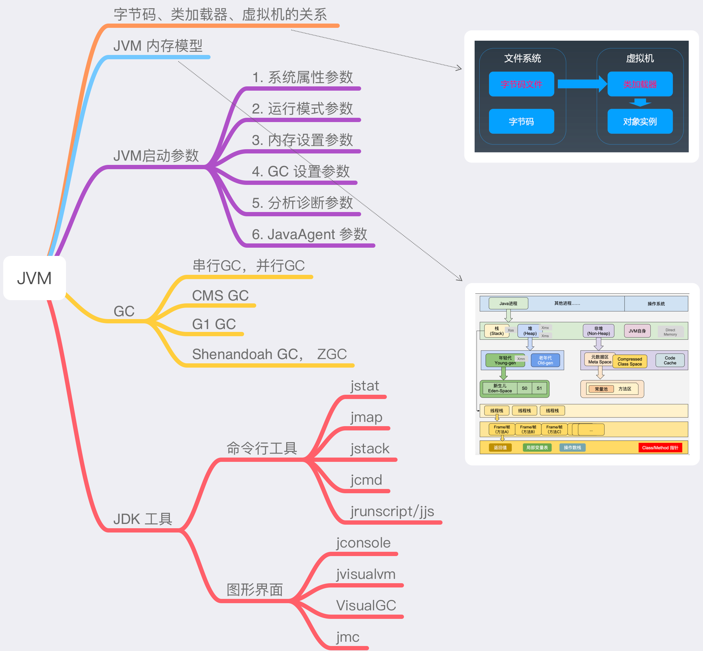
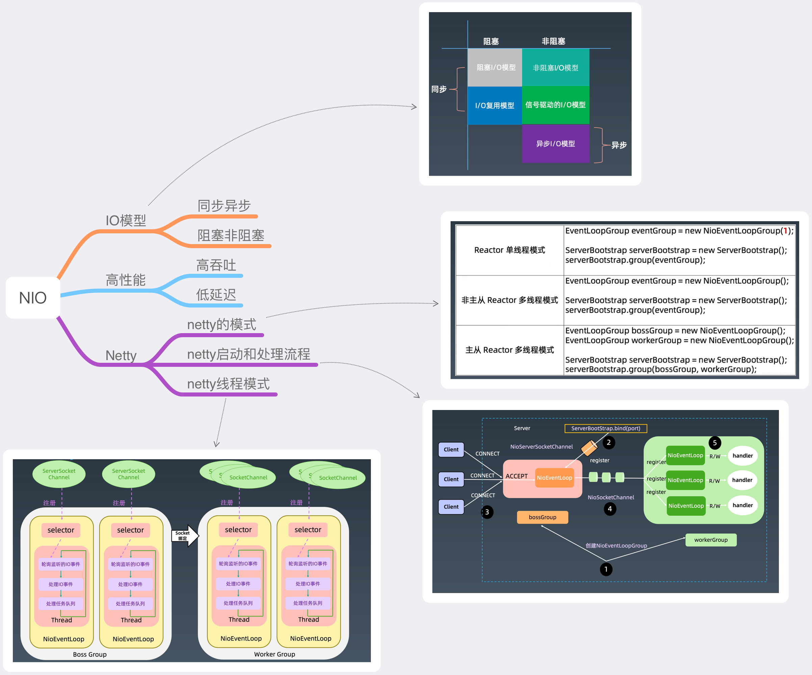
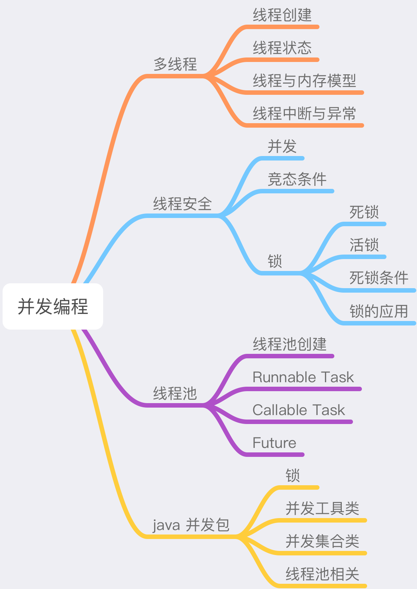
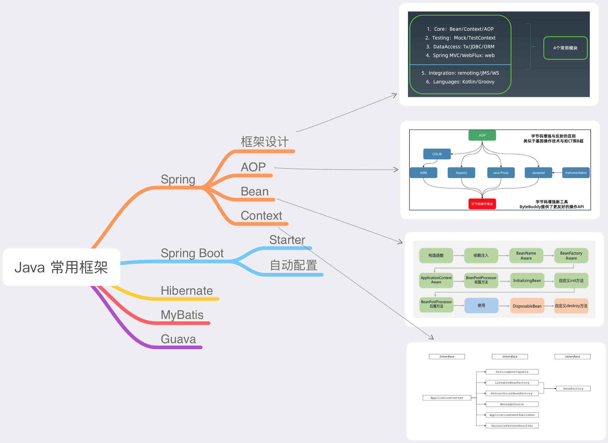
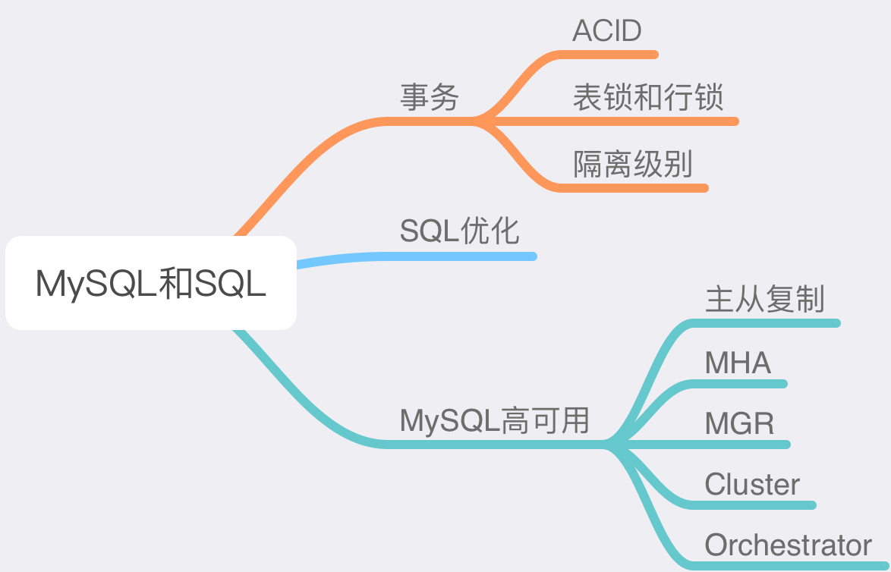
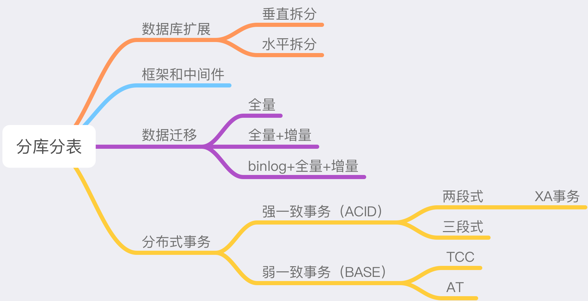
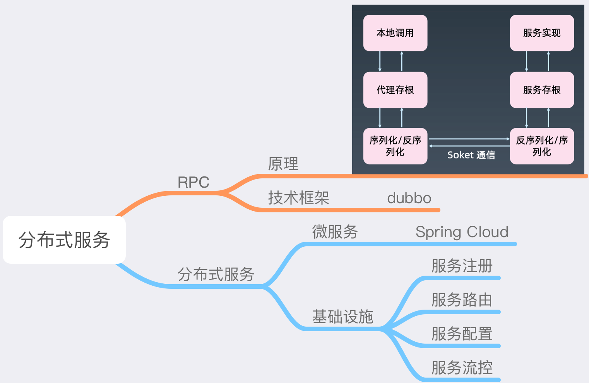
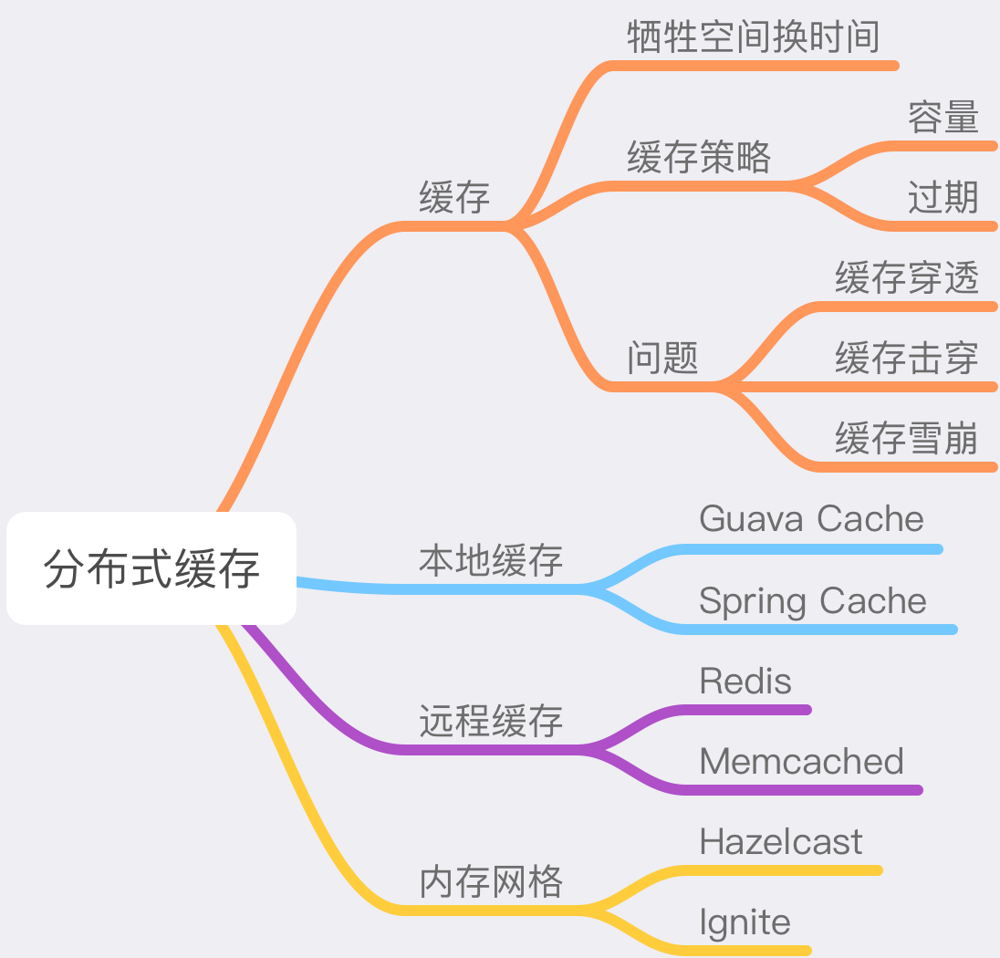

# 1. JVM

## 1.1 关于字节码、类加载器、Java虚拟机的理解

Java语言编译后的文件为字节码文件，Java虚拟机中运行程序，是直接解析运行的字节码，类加载器，实现了字节码文件到可执行程序的翻译工作。由此，Kotlin、Scala、Groovy等语言，由于也可以编译为字节码文件，也能运行在Java虚拟机中

## 1.2 关于JVM的内存模型认识

JVM内存模型，主要包括栈和堆两部分。每个线程都有自己的栈，且只能访问自己的栈，所有原生类型的局部变量都存储在线程栈中，而堆内存中包含了 Java 代码中创建的所有对象，故方法中的引用对象，栈桢中仅保存了引用地址，对象本身存储在堆中共享，这也是并发编程中需要用“锁”进行同步业务逻辑的根源。

## 1.3 JVM启动参数

JVM常用的启动参数，以 - 开头为标准参数，所有的 JVM 都要实现这些参数，并且向后兼容；-D 设置系统属性；以 -X 开头为非标准参数， 基本都是传给 JVM 的， 默认 JVM 实现这些参数的功能，但是并不保证所 有 JVM 实现都满足，且不保证向后兼容；以 –XX:开头为非稳定参数, 专门用于控制 JVM的 行为，跟具体的 JVM 实现有关，随时可能会在下 个版本取消；-XX:+-Flags 形式, +- 是对布尔值进行开关。 -XX:key=value 形式, 指定某个选项的值。JVM启动参数包括以下几类：

1. 系统属性参数 
2. 运行模式参数
3. 内存设置参数 
4. GC 设置参数
5. 分析诊断参数
6. JavaAgent 参数

其中，堆内存相关的参数，常用的主要有：-Xmx, 指定最大堆内存， -Xmx4g；-Xms, 指定堆内存空间的初始大小，如 -Xms4g；-Xmn, 等价于 -XX:NewSize，官方建议设置为 -Xmx 的 1/2 ~ 1⁄4；-XX:MaxDirectMemorySize=size，系统可以使用的最大堆外内存，这个参数跟 -Dsun.nio.MaxDirectMemorySize 效果相同；-Xss, 设置每个线程栈的字节数，影响栈的深度，如 -Xss1m 指定线程栈为 1MB，与-XX:ThreadStackSize=1m 等价。

## 1.4 GC

### GC基础

1. 分代假说
2. GC算法——标记清除算法(Mark and Sweep)

### GC相关的JVM启动参数

如：

- -XX:+UseG1GC:使用 G1 垃圾回收器
- -XX:+UseConcMarkSweepGC:使用 CMS 垃圾回收器
- -XX:+UseSerialGC:使用串行垃圾回收器 
- -XX:+UseParallelGC:使用并行垃圾回收器

e.g.

```bash
java -XX:+PrintGCDetails GCLogAnalysis
java -XX:+PrintGCDetails -XX:+PrintGCDateStamps -Xmx1g -Xms1g GCLogAnalysis
java -XX:+PrintGCDetails -XX:+PrintGCDateStamps -Xloggc:gc.demo.log -Xmx1g -Xms1g GCLogAnalysis
java -XX:+PrintGCDetails -XX:+PrintGCDateStamps -XX:+UseSerialGC -Xmx1g -Xms1g GCLogAnalysis
java -XX:+PrintGCDetails -XX:+PrintGCDateStamps -XX:+UseParallelGC -Xmx1g -Xms1g GCLogAnalysis
java -XX:+PrintGCDetails -XX:+PrintGCDateStamps -XX:+UseConcMarkSweepGC -Xmx1g -Xms1g GCLogAnalysis
java -XX:+PrintGCDetails -XX:+PrintGCDateStamps -XX:+UseG1GC -Xmx1g -Xms1g GCLogAnalysis
java -XX:+PrintGC -XX:+PrintGCDateStamps -XX:+UseG1GC -Xmx1g -Xms1g GCLogAnalysis
```


## 1.5 JDK 工具

- 命令行工具
- 图形界面工具

## 1.6 总结



# 2. NIO

## 2.1 IO 模型

IO模型从同步异步和阻塞非阻塞可以分为4类：

- 同步阻塞
- 同步非阻塞
- 异步阻塞
- 异步非阻塞

其中，关于同步异步说明如下：

1. 同步异步，是面向用户空间与内核空间的IO发起方式；同步IO是指用户空间的线程是主动发起IO请求的一方，内核空间是被动接受方；异步IO则反过来，是指系统内核是主动发起IO请求的一方，用户空间的线程是被动接受方
2. 阻塞非阻塞，面向的是用户空间的程序是否需要等待内核IO操作的完成；阻塞IO，指的是需要内核IO操作彻底完成后，才返回到用户空间执行用户的操作；阻塞指的是用户空间程序的执行状态；非阻塞IO，指的是用户空间的程序不需要等待内核IO操作彻底完成，可以立即返回用户空间执行用户的操作，即处于非阻塞的状态，与此同时内核会立即返回给用户一个状态值


由于异步IO在Windows系统中比较成熟，Linux下不成熟，而大部分服务器都是Linux的，故目前市面上常用的IO模型，都是同步模型。 

传统的IO模型都是同步阻塞IO。在Java中，默认创建的socket都是阻塞的

Netty是多路复用IO，其本质依然是同步非阻塞IO，只不过，常规的同步非阻塞IO，每个业务自己要单独分出一个线程，用于轮询确认数据是否从内核空间复制到用户空间；而多路复用，可以让多个业务共享一个select/epoll线程，一个select/epoll线程可以同时为大量业务做监听和轮询，从而提高了整体效率；另外，操作系统对epoll做了优化，让用户与内存共享同一块内存，避免了数据在二者之间的来回复制，进一步加强了性能。

## 2.2 Netty

### 2.2.1 Netty概览

1. 网络应用开发框架 

   1. 主要特征：
      1. 异步
      2. 事件驱动
      3. 基于 NIO
   2. 适用于:
      1. 服务端
      2. 客户端
      3. TCP/UDP/HTTP
2. 特征

   1. 高性能的协议服务器: 
       1. 高吞吐
       2. 低延迟
      3. 低开销
      4. 零拷贝
      5. 可扩容
   2. 松耦合:网络和业务逻辑分离
   3. 使用方便、可维护性好


### 2.2.2 Netty高性能

Reactor单线程 -> 非主从Reactor 多线程 -> 主从Reactor多线程

### 2.2.3 Netty优化

1. 应对粘包半包问题，需要定义恰当的编解码器解析数据，常用于tcp连接时
2. 优化连接（tcp，udp）
3. 不要阻塞eventloop
4. 优化系统参数
5. 优化缓冲区参数
6. 优化心跳周期
7. 优化内存和ByteBuf

## 2.3 总结




# 3. 并发编程


## 3.1 多线程基础


线程的创建，等待通知机制，线程的状态，线程中断和异常处理

## 3.2 线程安全与锁


线程安全与数据库事务的ACID类似，当多个线程同时访问同一段代码时，若这段代码中存在对共享变量（即JVM堆中存储的对象）的读写操作，由于JVM对代码执行的重排序，业务逻辑的原子性、隔离性代码编写不严谨，会造成数据的不一致问题，从而带来线程安全问题。

锁是保证线程安全的主要手段，实践中能用`synchronized`实现的锁，可以优先选用，更复杂的上锁场景，可以用java并发包中的各种锁，对于仅通过保证有序性和可见性就能避免的线程安全问题，可以使用更轻量级的`volatile`

锁背后的实现逻辑，是java的happen-before 原则，即：

1. 程序次序规则：一个线程内，按照代码先后顺序
2. 锁定规则：一个 unLock 操作先行发生于后面对同一个锁的 lock 操作
3. Volatile 变量规则：对一个变量的写操作先行发生于后面对这个变量的读操作
4. 传递规则：如果操作 A 先行发生于操作 B，而操作 B 又先行发生于操作 C，则可以得出 A 先于 C
5. 线程启动规则：Thread 对象的 start() 方法先行发生于此线程的每个一个动作
6. 线程中断规则：对线程 interrupt() 方法的调用先行发生于被中断线程的代码检测到中断事件的发生
7. 线程终结规则：线程中所有的操作都先行发生于线程的终止检测，我们可以通过 Thread.join() 方法结束、 Thread.isAlive() 的返回值手段检测到线程已经终止执行
8. 对象终结规则：一个对象的初始化完成先行发生于它的 finalize() 方法的开始

锁能够保证线程安全，但锁也需要合理使用，锁的粒度太大，代码的并行能力太低，会降低代码执行效率，当业务需要上多个锁时，要注意避免死锁或活锁。

## 3.3 线程池


Java中的线程，调用的是操作系统层面的线程，其创建和销毁的成本不低，故需要频繁用到线程的地方，若频繁的创建销毁线程，程序的性能会大大损失，更合理的方式，是把线程变成“池化”资源共享，以提高利用率。

线程池，即Executor，可以通过ThreadPoolExecutor定制化创建，也可以通过Executors工具类便捷创建，不过在业务量级较大，消费能力跟不上生产能力时，Executors可能会出现OOM问题，故其使用相比于ThreadPoolExecutor要更加谨慎，使用ThreadPoolExecutor创建线程池时，由于明确指定了核心线程数、最大线程数、线程创建工厂、工作队列和拒绝策略等参数，因此更加安全可靠。

利用线程池异步执行任务，主要通过execute和submit两类接口实现，前者用于任务无返回值的场景，后者会把返回值放到`future`对象中。future中真实数据的获取，既可以通`get()`方法同步获取，也可以放到guava封装后的future中通过回调机制异步执行后续业务逻辑。

## 3.4 java并发包


（1）锁相关的类

常用的锁相关类为，Lock, Condition, ReentrantLock, ReadWriteLock

Java并发包中的大部分锁，除了提供与`synchronized`关键字类似的锁功能外，还提供了"try lock with timeout"和"try lock with interuptions"功能，在避免死锁上有更大的自由度。

（2）原子类

如AtomicInteger, AtomicLong等，原子类通过CAS和“自旋”来保证并发时的数据一致性，开销比锁小，性能比锁高，使用也更方便。

（3）线程池相关类

除了上文已经提到的内容，再补充一个`CompletableFuture`，通过ComplatableFuture，可以方便的组合并行、串行任务，等待多线任务均完成后执行下一任务，或等待多线任务任一任务完成后执行下一任务等复杂任务并发执行场景。

（4）并发工具类

主要是三个工具类：

- CountDownLatch，用于等待线程执行结束，与`join()`类似
- CyclicBarrier，实现让线程同时启动执行
- Semaphore，即信号量，是另一种锁的实现方式，也可以用于实现类似限流或线程放行的逻辑，这里必要情况下需要与锁搭配使用

（5）并发集合类

即最常用的ConcurrentHashMap，BlockingQueue，CopyOnWriteArrayList等，提供线程安全的集合类实现，实现生产者消费者模式等。


## 3.5 总结



# 4. Java常用框架

## 4.1 Spring 和Spring Boot

Spring是一个IOC框架，核心在于Bean、Context和AOP

Spring Boot的核心是starter，自动配置，Spring Boot CLI和Actuator，Spring Boot让Spring变得更加强大易用，也为Spring Cloud的发展奠定了基础。

## 4.2 Hibernate和MyBatis


Hibernate 和MyBatis 均为ORM框架；二者相较而言，Hibernate对象化更彻底，屏蔽了SQL相关的细节，甚至即便开发者对SQL没有充分精通的情况下，也能写出性能不错的数据库操作功能；而MyBatis只能算作半个ORM，SQL语法、SQL相关的复杂度都暴露在开发者面前，因此相对的，SQL相关的实现对开发者也更可控，对SQL的性能要求比较高时，比Hibernate更有优势。

MyBatis在开发中，一个比较显著的缺点是，由于SQL语法暴露在开发者的代码中，所以切换不同数据库时，由于SQL语法中的差异，对代码是有影响的，而Hibernate中，由于SQL操作是框架自动生成，没暴露在开发者面前，故数据库的切换对代码影响较低。

## 4.3 Guava

Guava对java标准库做了增强，常用的功能包括，对集合类、字符串的各类操作，对集合类、多线程和异步的增强，提供了缓存机制和事件总线。


## 4.4 总结




# 5. SQL 和 MySQL数据库


## 5.1 SQL


- DQL
- DML
- DDL
- TCL
- DCL
- CCL

## 5.2 MySQL 高性能

### 5.2.1 配置优化


（1）连接请求的变量

1. max_connections
2. back_log
3. wait_timeout和interative_timeout

（2）缓冲区变量

1. key_buffer_size
2. query_cache_size
3. max_connect_errors 
4. sort_buffer_size
5. max_allowed_packet=32M
6. join_buffer_size=2M
7. thread_cache_size=300

（3）配置 Innodb 的几个变量

1. innodb_buffer_pool_size=128M
2. innodb_flush_log_at_trx_commit
3. innodb_thread_concurrency=0
4. innodb_log_buffer_size
5. innodb_log_file_size=50M
6. innodb_log_files_in_group=3
7. read_buffer_size=1M
8. read_rnd_buffer_size=16M
9. bulk_insert_buffer_size=64M 
10. binary log

### 5.2.2 数据库设计优化


- 如何恰当选择引擎?
- 库表如何命名?
- 如何合理拆分宽表?
- 如何选择恰当数据类型:明确、尽量小
  - char、varchar 的选择
  - (text/blob/clob)的使用问题?
  - 文件、图片是否要存入到数据库? - 时间日期的存储问题?
  - 数值的精度问题?
- 是否使用外键、触发器?
- 唯一约束和索引的关系?
- 是否可以冗余字段?
- 是否使用游标、变量、视图、自定义函数、存储过程? - 自增主键的使用问题?
- 能够在线修改表结构(DDL 操作)?
- 逻辑删除还是物理删除?
- 要不要加 create_time,update_time 时间戳?
- 数据库碎片问题?
- 如何快速导入导出、备份数据?

### 5.2.3 MySQL 事务


- 锁（表级锁，行级锁）
- ACID
- 隔离级别
  - 读未提交: READ UNCOMMITTED
  - 读已提交: READ COMMITTED
  - 可重复读: REPEATABLE READ
  - 可串行化: SERIALIZABLE
- 日志
  - redo log
  - undo log
- MVCC

## 5.3 MySQL高可用


- 主从复制

- 读写分离

- 分库分表

## 5.4 总结




# 6. 分库分表

分库分表，是实现数据存储水平扩展的主要手段，实践时可以结合实际情况，决策使用“分库”、“分表”、还是同时做“分库和分表”。

分库最简单，我们结合业务实际情况，把独立的关联不大的业务拆分到不同的数据库中，来提高数据的存储能力。分库通常的出发点，是基于业务的拆分，很少单纯因为数据量过大而做分库。

分表，主要是为解决单表数据量过大的问题，通过分表降低单表数据量，提高查询效率；分表常用的手段，包括按某业务熟悉ID取模拆分、按时间熟悉拆分和按业务逻辑拆分等。

同时做分库和分表，是最复杂的场景，要同时考虑业务拆分和数据量过大的问题，拆分后，新增的数据查询维护复杂度也最多。

分库分表，造成的影响是，带来分布式事务。分布式事务，本质上是数据库事务复杂度的转移，从原来的数据库内部复杂度，转移到数据库外部，暴露在开发者面前，需要开发者来解决；因此，数据库内部的事务处理逻辑，是可以借鉴到分布式事务的具体实现中的。

分布式事务，分为强一致事务和柔性事务两类；强一致事务，基于ACID理论，包括两段式和三段式两种实现思路，现在使用最多的是基于XA的两段式事务；柔性事务，基于BASE理论，包括TCC/AT和SAGA等实现方式，柔性事务，需要在开发层面设计事务失败时的补偿机制，本质上是数据库内部的事务处理逻辑在外部的应用。




# 7. RPC和微服务

## 7.1 RPC

RPC即远程过程调用，单机的程序之间的调用是进程间的，而RPC实现了程序间通过网络通信的调用。RPC的实现，需要通信双方对通信协议、通信接口、数据的载体以及序列化反序列化方式达成共识，从而双方能够基于该统一的约定实现彼此的通信。RPC的实现，上面几个条件虽然可以随意搭配的，其发展过程中也出现了WSDL、SOAP等协议，但从开发上看，RPC始终是对同构的技术路线更友好，异构的技术之间如果想通过RPC进行通信，在没有SDK或ESB的情况下，要从比较底层的技术做起。我所接触的系统中，很少会涉及到基于RPC做系统间的集成。

RESTful是Web Service兴起后脱颖而出的架构风格，RESTful只是一种架构风格，本质上是RPC的一个子集，它把服务固化为面向资源，统一通信协议用http，把http方法对应到资源的CRUD操作，数据载体采用对人友好的xml或json，并配合http code的语意作为response，从而开发上更加简单友好，异构系统间通信也更容易。

RPC可以具有RESTful更高的性能，但RESTful比较简单，对异构系统的通信也更友好，故在微服务中RESTful架构风格应用更多。

## 7.2 微服务

微服务是当下最火的技术，它是对SOA的升级。微服务把服务粒度拆分为比SOA更小的颗粒度，把总线拆解为一系列微服务基础设施，它不仅解决了SOA的痛点，也能把面向对象的思想融于其设计，因此微服务大能取代SOA，小能升级单机/单体架构。



# 8. 分布式缓存

缓存，是提高系统性能的重要手段，缓存能够平衡高速计算和低速IO之间的落差，让系统整体保持在一个高性能的状态。

缓存包括本地缓存和集中式缓存，本地缓存，即使用本地内存作为缓存的存储，而集中式缓存，采用的是通过网络协议进行数据通信的服务。

使用缓存时，最需要关心的问题是，缓存穿透，缓存击穿和缓存雪崩问题

分布式缓存，现在最主流的是使用redis，redis的单机、主从复制、分片和集群都比较方便配置；在redis之上，更新的分布式缓存技术，是内存网格，它统一了本地缓存和集中式缓存，如hazelcast，具备分布式、高可用、面向对象和低延迟的特性。



# 9. 分布式消息队列

消息队列，本质上是观察者模式的一种实践，解藕了生产和消费的业务逻辑，提高了系统的稳定性、可维护性和可扩展性。

消息队列的技术发展，最初是使用内存中的队列，后发展为独立的消息队列服务，现在主流的是高性能的分布式消息队列服务。发展至今，消息队列具备异步通信、系统解藕、削峰平谷、可靠通信的优势。

